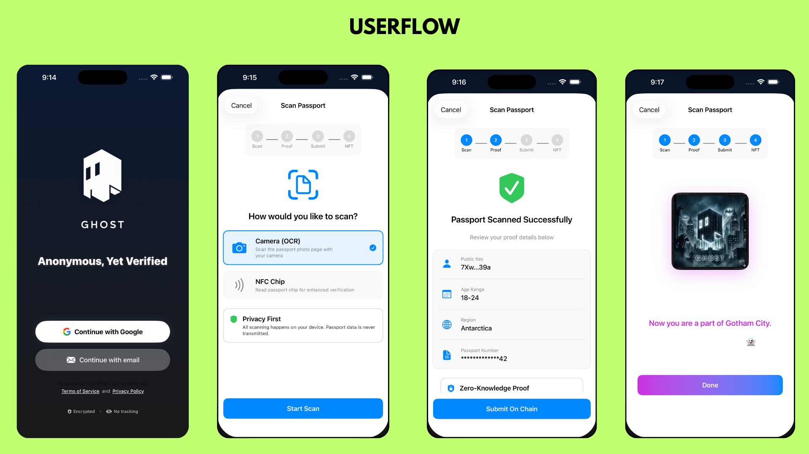

# Ghost 

**Privacy-preserving identity verification for the real world.**

Ghost lets you prove who you are without revealing who you are. Scan your passport, get verified, stay anonymous.

---

## The Problem

Every time you want to prove your age, nationality, or identity online, you have to hand over your actual data. Your name, passport number, everything — stored on some company's server, waiting to be leaked or sold.

That's broken.

## What Ghost Does

Ghost flips the script. You scan your passport locally on your phone. The app extracts what's needed, randomizes the specifics, and generates a cryptographic proof that says *"yes, this person is real and meets the criteria"* — without revealing anything else.

**What gets shared on-chain:**
| Your Data | What We Store |
|-----------|---------------|
| John Smith | `7Xw...39a` (your wallet public key) |
| Age 23 | "18-24" (range only) |
| India | "South Asia" (region only) |
| ABC1234567 | "XX67" (last 2 digits only) |

Everything happens **offline**. Your passport image? Deleted immediately after scanning. The MRZ data? Never leaves your phone. All that goes on-chain is the anonymized proof.

## How It Works

1. **Create a wallet** — We spin up a Privy wallet for you. No seed phrases to lose, no extensions to install.

2. **Scan your passport** — Point your camera at the MRZ (the text at the bottom). OCR extracts the data locally.

3. **Generate your proof** — The app creates a zero-knowledge proof that attests to your identity without revealing it. Approximately 30-60 seconds of local computation.

4. **Mint your Ghost NFT** — The proof gets submitted to Solana. You receive a soulbound NFT that represents your verified identity. This is your "Ghost" — proof you're a real human without the doxxing.

5. **Use it everywhere** — Companies can verify you're real just by checking if you hold the NFT. No KYC forms, no data collection, no risk.

## zk-Census

Ghost also includes **zk-Census** — a way for startups, DAOs, and digital communities to measure their population without doxxing members.

Think about it: how does a DAO know its actual demographic distribution? Right now, they don't. Members don't want to share personal info, and there's no way to verify claims even if they did.

With zk-Census:
- Companies create a census with specific criteria (age range, region, etc.)
- Users submit their Ghost proofs to participate
- The census aggregates statistics without linking any data back to individuals
- Result: "We have 1,200 verified humans, 60% are 25-34, spread across 4 continents" — zero personally identifiable information exposed

## Tech Stack

- **iOS** — Native SwiftUI app
- **Passport Scanning** — Vision framework for OCR, CoreNFC for chip reading (when available)
- **Wallet** — Privy embedded wallets (no MetaMask, no browser extensions)
- **Blockchain** — Solana (fast, cheap, good mobile SDKs)
- **Zero-Knowledge Proofs** — Groth16 proofs generated on-device
- **Gas Fees** — Eliminated via Magic Blocks session keys (users don't pay)

**Requirements:**
- Xcode 15+
- iOS 16+
- Physical device for NFC passport scanning

## Privacy Guarantees

- ✅ Passport image deleted immediately after OCR
- ✅ Raw passport data never transmitted anywhere
- ✅ ZK proofs generated entirely on-device
- ✅ Only anonymized, range-based data goes on-chain
- ✅ No central database of identity data
- ✅ Nullifier prevents double-registration without revealing identity

## Why "Ghost"?

Because once you're verified, you can move through the digital world like a ghost. You're there, you're real, you can interact with services that need to know you're a human but nobody knows *which* human. 

You're anonymous. You're a ghost. 

---

## Roadmap

- [ ] Active Authentication for NFC passport chips
- [ ] Support for ID cards and driver's licenses
- [ ] Cross-chain proof verification
- [ ] SDK for third-party integration
- [ ] Browser extension for web-based verification

## License

Apache 2.0 — see [LICENSE](LICENSE) for details.

---